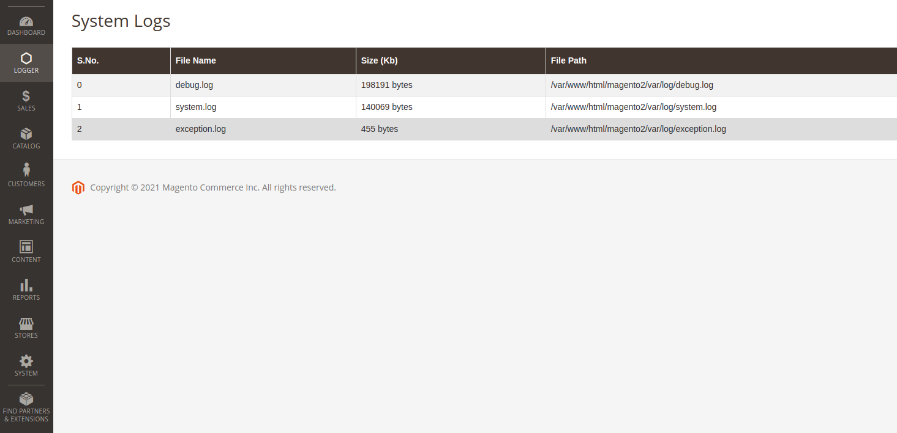

Logger for Admin page in Magento 2
==================

This is an admin panel module written for magento2. Its display all the logs files in sort. 

Installation
-------------

**Download Zip**
* Download the [Zip File](https://github.com/MehtabAhmed176/BackendAdminLogger/archive/master.zip)
* Extract & upload the files to `/path/to/magento2/app/code/Bss/CreateMenuBackend`
* The code should reside in the above directory structure

After installation by , enable the extension by running following commands (again from root of Magento2 installation):
```
php bin/magento setup:upgrade

php bin/magento setup:di:compile

php bin/magento setup:static-content:Deploy -f 

chmod -R 777 var/ generated/
```

ScreenShot
-------------

